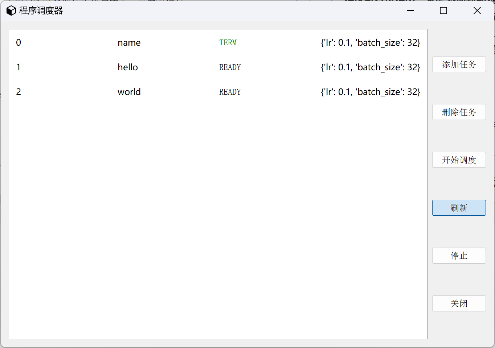
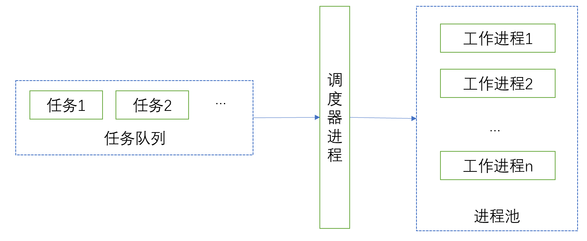

# 程序调度器

### 项目概述

#### 动机

做实验过程中，通常我们需要进行调参，最暴力的方法是网格调参，比较简单的实现就是有几个参数就写几个for循环，比如：

```python
def main(args):
    # 主函数...
    pass


args = {}
lrs = [0.01, 0.03, 0.06]
batch_sizes = [32, 64, 128]
for lr in lrs:
    for batch_size in batch_sizes:
        args.lr = lr
        args.batch_size = batch_size
        main(args)
```

但是这种写法有以下缺点：

> **程序执行过程中，不能添加新的参数、不能删除未执行的参数**。比如，我们共需要调参数lr和batch size，每个参数3中选择，组合起来就是9组参数，我们把程序运行起来，程序会顺序执行这9组参数，过程中你不能给batch size再添加一个新的值，只能等程序运行完毕，或者你手动终止程序，进行修改。也不能对未执行的参数进行删除。

#### 实现功能

主窗口：显示当前任务信息（id、名称、运行状态、进度条等），其他相关操作按钮。

加载参数：从yaml文件中动态加载要调的参数，窗口中显示各个参数。

添加任务：自定义任务参数，将任务添加到任务队列中（先来先服务策略）。

删除任务：对未执行的任务进行删除。

开始调度：内部创建进程池（可指定进程池个数），每个工作进程负责从调度队列中选择一个可执行的任务进行执行。

刷新：主窗口实时获取任务执行状态、进度等信息。




### 使用文档

项目完成后更新。


### 实现细节

#### 总体设计




调度器内部方法：

> start(): 开始调度，内部创建进程池，每个工作进程执行run()方法。
>
> run(): 循环遍历任务队列，找到可执行任务，处理任务，等待任务执行完毕。

访问任务队列时需要进行加锁。


#### 设计类

##### 任务

对于每一组参数，运行一个程序，该程序就是一个任务，任务应该包含参数列表，任务执行的主函数，任务状态等情况，然后将任务存放到调度队列中。（应该再加一个回调函数，用于告诉主进程任务执行状态、进度）

##### 任务状态

待执行、正在运行、已执行完毕、异常结束。

##### 调度器

负责从调度队列中取任务，然后交给执行任务的进程程来处理。


### 待完善功能

访问任务队列加锁。

设置定时器，刷新窗口中任务信息。

从yaml中加载要调的参数，而不是写死在界面里，设置循环加载参数。

界面显示进程池进程个数、进度条等信息。

手动调整任务优先级。

参数去重功能。

正在运行状态，显示不出来，因为未将结果返回到共享通信队列中。

感觉进程之间通信用队列不是最优的方法，还需要改，最好是执行完成后，执行回调函数，主动告诉调度器任务完成或者任务完成的状态。